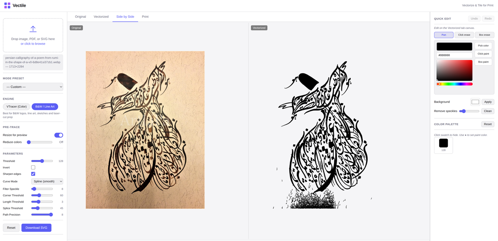
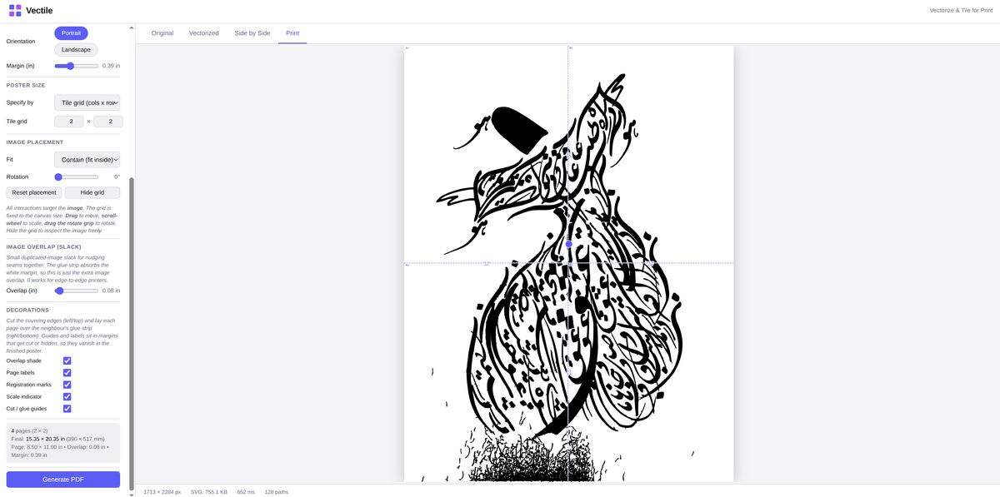

# Vectile

**Free, local image vectorizer and poster tiler** — turn PNG, JPG, PDF, or SVG into clean SVG paths, edit in the browser, and print large posters on any normal home or office printer.

Vectile is an open-source alternative to paid online tools like [Vectorizer.io](https://www.vectorizer.io/), [Vector Magic](https://vectormagic.com/), and design apps like [Canva](https://www.canva.com/) when you want **vector tracing plus tiled poster printing** without a subscription or cloud upload. Everything runs on your machine: no uploads, no account, no per-export fee.

**Vectorize → edit → download SVG → tile to PDF → print and assemble at home.**

---

## Print big posters on a normal printer

Most home printers only handle A4 or Letter — not wall-sized art. Vectile splits your design into a **grid of pages** (2×2, 3×4, or whatever you need), exports a multi-page PDF, and draws **cut and glue guides** on each sheet so you can tape or glue them into one large poster.

This is the same idea as “poster print” or “tile pages” workflows in Canva and similar sites, but **built in and fully local**:

| | Canva, online design tools | Vectile |
|---|---------------------------|---------|
| **Poster tiling** | Often Pro-only or export-then-manual split | **Free**, built into the Print tab |
| **Where files go** | Cloud account | **Your computer only** |
| **Vector art** | Mostly raster/design templates | **True SVG** paths — sharp at any size |
| **Assembly help** | Varies | **Cut / glue labels**, overlap zones, page grid (A1, B2, …) |
| **Paper** | Presets + custom | A4, Letter, Legal, Tabloid, **custom mm/in** |

**Typical workflow:** vectorize a logo, illustration, or photo trace → open **Print** → choose **Tile** mode and set columns × rows (or poster size) → drag to position the image on the poster canvas → download PDF → print every page on plain paper → trim on **CUT** lines and overlap on **GLUE** strips.

Works well for classroom displays, event banners, shop signs, and craft projects — anywhere you have a consumer inkjet or laser printer and tape, not a plotter or print shop.

---

## Screenshots

**Side-by-side compare** — original raster vs vector result with synced pan and zoom.



**Print tab** — poster layout, tile grid, cut/glue assembly guides, and PDF export.



*(Full resolution: [side-by-side.png](screenshots/side-by-side.png) · [print_tab.png](screenshots/print_tab.png))*

---

## Why Vectile?

| | Online vectorizers (Vectorizer.io, etc.) | Vectile |
|---|------------------------------------------|---------|
| **Cost** | Subscription or per-image credits | Free (MIT) |
| **Privacy** | Upload images to their servers | 100% local — files never leave your PC |
| **Poster printing** | Export or order prints; tiling often paid/cloud | **Free tile PDF** with cut/glue guides on standard paper |
| **Editing** | Limited or none | In-app erase, paint, palette, background |
| **Offline** | Requires internet | Works offline after install |
| **PDF input** | Often raster-only | Multi-page PDF with DPI control |
| **SVG workflow** | Uncommon | Upload SVG from Inkscape, edit, re-export |

Inkscape and Adobe Illustrator trace bitmaps too, but Vectile adds **live parameter preview**, **palette editing**, and **home-printer poster tiling** in one focused tool — without a full DTP suite or Canva subscription.

---

## Features

### Vectorize
- **Inputs:** PNG, JPG, WebP, BMP, PDF (multi-page), SVG
- **Engines:** VTracer (color) and B&W / line art (Potrace-style)
- **Presets:** illustration, outline, pixel art, line drawing, posterize
- **Live preview** with debounced re-trace as you adjust sliders
- **Resize for preview** for fast iteration on large images; full-res SVG on download
- Tabs: Original, Vectorized, Side by Side, Print

### Quick Edit
- Erase or paint paths (click or box select)
- HSL color picker with eyedropper
- Background color behind artwork
- Speckle cleanup, undo/redo
- **Color palette** — hide or recolor any traced color; changes export to SVG and print

### Print (poster tiling)
- **Tile mode** — split any poster across A4, Letter, Legal, Tabloid, or custom paper; set grid (e.g. 2×2, 3×4) or final dimensions
- **Single-page mode** — one PDF at poster size for print shops or large-format printers
- **WYSIWYG preview** — drag, scale, and rotate the image on a poster canvas; grid shows exactly what each page will contain
- **Cut/glue assembly guides** — page labels (A1, B2, …), overlap bands, registration marks, and trim hints for taping at home
- **Overlap control** — extra margin on seams for easier alignment when joining sheets
- One-click **multi-page PDF** download — print all pages on a normal printer, assemble into one large poster

---

## Quick start

**Requires:** [uv](https://docs.astral.sh/uv/) (installs its own Python) — or see [docs/INSTALL.md](docs/INSTALL.md) for pip, launchers, and troubleshooting.

```bash
# macOS / Linux — install uv once:
curl -LsSf https://astral.sh/uv/install.sh | sh

# Install and run:
uv tool install git+https://github.com/whyzgeek/VecTile
vectile
```

Open **http://127.0.0.1:8000** (browser may open automatically).

**No terminal?** Double-click `Vectile.bat` (Windows), `Vectile.command` (macOS), or `vectile.sh` (Linux) after cloning the repo.

---

## Documentation

- **[Installation guide](docs/INSTALL.md)** — all install paths, platform notes, troubleshooting
- **[Usage guide](docs/USAGE.md)** — controls, Quick Edit, print workflow, engine parameters

---

## License

MIT
